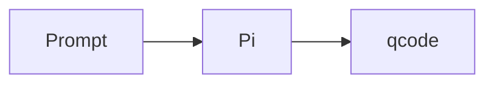

# Plan 37: Render Mermaid Fences as Diagrams

## Goal

Render fenced `mermaid` blocks in assistant messages as diagrams in the session-detail webview instead of presenting them only as ordinary code blocks.

A message such as:

````markdown

````

should show a theme-aware SVG diagram. Ordinary fenced code blocks, user messages, and thinking summaries should retain their current behavior.

## Current Behavior

`src/webviews/messageRendering.ts` contains qcode's browser-side Markdown parser. Every fence is currently emitted by `flushCode()` as the same `.code-block` structure, with the fence language used only for a `language-*` class. No syntax-specific renderer runs afterward, so `mermaid` is correctly recognized as a fence language but remains escaped source text.

Both initial persisted messages and optimistic/live messages eventually pass through `qcodeMessageRendering.renderMessageTextElement()`. That is the right shared integration point: Mermaid support implemented there will work for initial loads, bridge snapshots, appended live messages, and message replacement without changing session persistence or the Pi bridge.

## Architectural Decision

### Bundle Mermaid with the extension

Use the official `mermaid` browser bundle at a pinned version. Do not load Mermaid from a CDN or require internet access from the webview.

Add Mermaid as a development/build dependency and add a small build script that copies only its standalone minified browser bundle from `node_modules/mermaid/dist` to a generated path such as:

```text
media/vendor/mermaid.min.js
```

Keep the generated bundle out of source control, but include it in the VSIX. Update `scripts/verify-vsix.cjs` to fail packaging if the Mermaid asset is absent. This avoids shipping Mermaid's full dependency tree while keeping dependency/version updates visible in `package.json` and `package-lock.json`.

Load the local bundle lazily the first time a Mermaid placeholder is encountered. The loader must cache one promise so multiple diagrams and live updates never add duplicate script elements. A diagram-free session should not pay Mermaid's parse/initialization cost.

### Keep qcode's existing Markdown parser

Do not replace the entire Markdown implementation as part of this feature. Extend fenced-block handling only. A broader Markdown-library migration would change unrelated rendering behavior for lists, tables, links, file references, and copy actions.

### Render only assistant Markdown fences

Treat a fence as Mermaid when its first info-string token compares case-insensitively to `mermaid`. The existing parser already reduces the info string to its first token. Since user messages and thinking messages intentionally do not use `renderMarkdown()`, they remain plain text and are not executable diagram input.

## Implementation

### 1. Package the browser asset

Update:

- `package.json`
- `package-lock.json`
- `.gitignore`
- `scripts/verify-vsix.cjs`

Add a script such as `scripts/copy-mermaid.cjs` and run it from `compile`/`vscode:prepublish` before TypeScript compilation. The script should:

1. resolve the pinned Mermaid bundle from `node_modules`;
2. create `media/vendor` if needed;
3. copy the single minified browser artifact to `media/vendor/mermaid.min.js`;
4. fail with an actionable message if dependencies have not been installed or Mermaid changes its distribution layout.

Ignore the generated `media/vendor/mermaid.min.js` in Git, but do not exclude it in `.vscodeignore`. Extend VSIX verification to check both `pi-extensions/qcode-bridge.ts` and the Mermaid bundle.

### 2. Expose the asset to session-detail webviews

Update `src/extension.ts` to construct a webview URI from:

```ts
vscode.Uri.joinPath(context.extensionUri, "media", "vendor", "mermaid.min.js")
```

Pass that URI to both existing-session and new-session calls to `renderSessionDetail()`. The extension's `media` directory is already an allowed local resource root for notification audio; make that intent explicit by using a general extension-media root rather than adding a Mermaid-specific root.

Update the session-detail CSP in `src/webviews/sessionDetail.ts` so the nonce-bearing local Mermaid script is permitted by `script-src`. Keep `default-src 'none'`; do not add CDN origins, `unsafe-eval`, broad network access, or inline scripts without the existing nonce.

### 3. Emit Mermaid placeholders while parsing fences

Update `src/webviews/messageRendering.ts` so `flushCode()` has two paths:

- non-Mermaid fences continue emitting the current code-block HTML unchanged;
- Mermaid fences emit a `.mermaid-block` containing:
  - an initially empty diagram output region;
  - the escaped original source in the existing `<pre><code class="language-mermaid">` structure;
  - the existing copy button;
  - a hidden, accessible error/status region.

Show the source while rendering is pending. On success, insert the rendered SVG and hide the source. On failure, leave the escaped source visible and show a short error label. Never replace a failed diagram with blank space.

Keeping the source `<code>` element in the wrapper also preserves the current delegated Copy behavior: copying a successful or failed Mermaid block still copies the original Mermaid definition, not generated SVG markup.

### 4. Add a safe asynchronous Mermaid renderer

Extend `qcodeMessageRendering` with Mermaid configuration/loading/rendering functions and call the renderer at the end of `renderMessageTextElement()` after `innerHTML` has created placeholders.

The renderer should:

1. lazy-load the configured local script once with the page nonce;
2. initialize Mermaid with `startOnLoad: false` and `securityLevel: "strict"`;
3. use a conservative configuration such as HTML labels disabled and Mermaid's text/edge limits retained or tightened;
4. read source from the placeholder's text content, not an HTML or JavaScript data payload;
5. generate a unique render ID for every attempt to avoid SVG ID collisions;
6. render diagrams through a small sequential promise queue, avoiding Mermaid DOM-helper collisions when a message contains several diagrams;
7. check that the placeholder is still connected before and after awaiting render, since bridge snapshots can replace message elements mid-render;
8. insert only Mermaid's strict-mode SVG result into the output region;
9. catch parse/load/render errors per diagram and activate the source fallback without breaking the rest of the message.

Do not send diagram source to the extension host. Rendering is entirely local to the webview and does not alter `SessionMessage`, JSONL parsing, bridge events, or model context.

### 5. Match VS Code presentation and theme changes

Add styles in `messageRenderingStyles` for:

- horizontally scrollable diagram output when a graph cannot shrink further;
- centered SVGs with `max-width: 100%` and automatic height;
- transparent backgrounds so VS Code's message surface remains authoritative;
- pending, rendered, and error states;
- a visible fallback error using `--vscode-errorForeground`;
- the existing hover/focus Copy affordance over Mermaid blocks.

Initialize Mermaid with a light/dark theme selected from VS Code's body classes and VS Code font/color values where Mermaid theme variables support them. Install one `MutationObserver` for body theme-class changes and rerender connected Mermaid blocks from their retained source. This prevents diagrams from becoming unreadable when the user changes color theme without reopening qcode.

Set an accessible label/role on successful SVG output. Do not rely on color alone for graph meaning; Mermaid source authors remain responsible for semantic labels.

## Security and Failure Boundaries

- Mermaid input is untrusted assistant output. Use strict security mode and do not enable loose HTML labels, click callbacks, external scripts, or Mermaid directives that weaken the configured security policy.
- Keep source and errors escaped/text-only. Do not inject exception messages through `innerHTML`.
- The webview CSP remains the final boundary for scripts and network requests.
- Invalid or unsupported Mermaid syntax degrades to today's readable/copyable code block.
- A missing packaged bundle degrades in the UI but must also be caught by package verification before release.
- Preserve Mermaid's built-in input limits and render sequentially to limit UI stalls. Additional cancellation/worker infrastructure is out of scope unless real sessions show a performance problem.

## Tests

Add `src/test/mermaidRendering.test.ts` with focused generated-webview assertions covering:

1. the session detail receives the local Mermaid asset URI and permits only the nonce-bearing local script under CSP;
2. the generated renderer recognizes the `mermaid` fence language case-insensitively while leaving other fences on the existing path;
3. Mermaid initialization includes `startOnLoad: false` and `securityLevel: "strict"`;
4. rendering is invoked from `renderMessageTextElement()`, covering both initial and live message paths;
5. the Mermaid wrapper retains escaped source and a `.code-block-copy-button`;
6. the catch path preserves source and exposes an error state;
7. user and thinking messages still bypass Markdown/Mermaid rendering;
8. the VSIX verification script requires `extension/media/vendor/mermaid.min.js`.

If practical without introducing a browser-test framework, expose the fence-to-HTML helper for direct unit tests. Otherwise keep source-generation tests focused and perform the DOM behavior in the manual matrix below rather than adding a large test dependency solely for this feature.

Run:

```sh
npm test
npm run package
```

Confirm package verification succeeds and inspect the VSIX to ensure only the standalone Mermaid asset—not Mermaid's complete `node_modules` dependency tree—is included.

## Manual Validation Matrix

In an Extension Development Host, verify:

1. a valid flowchart renders after opening a persisted session;
2. a valid sequence diagram appended during a live run renders without reopening the session;
3. two diagrams in one assistant message render independently;
4. uppercase ```` ```MERMAID ```` is accepted;
5. an invalid diagram remains visible as source with a concise error state;
6. an ordinary `ts` fence renders exactly as it does today;
7. Copy on a rendered diagram copies its Mermaid source;
8. external links and file references elsewhere in the same message continue working;
9. switching among light, dark, and high-contrast VS Code themes rerenders legibly;
10. a very wide diagram scrolls within the message and does not widen the sidebar;
11. sessions without diagrams do not add/load the Mermaid script;
12. navigating or receiving a snapshot while rendering does not produce stale SVGs or uncaught promise errors.

## Out of Scope

- Mermaid rendering in user messages, thinking summaries, the composer, editors, or terminal output.
- Editing diagrams or adding zoom/pan/export controls.
- Replacing qcode's complete Markdown parser.
- Server-side or extension-host SVG generation.
- CDN fallback or network access.
- Persisting rendered SVG in session files.
